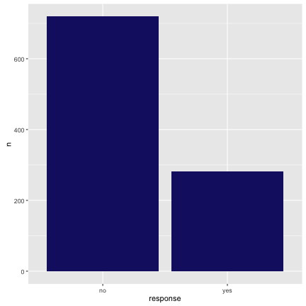
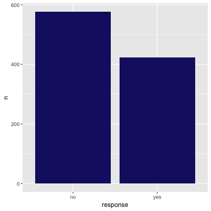

<!-- README.md is generated from README.Rmd. Please edit that file -->

WWC: Weighing the Wisdom of Crowds
----------------------------------

**Authors:** [Heather Krause](http://idatassist.com/), [Julia Silge](http://juliasilge.com/)<br/>
**License:** [MIT](https://opensource.org/licenses/MIT)

[](https://travis-ci.org/heathermkrause/WWC)
[](https://cran.r-project.org/package=WWC)
[](https://codecov.io/github/heathermkrause/WWC?branch=master)


This R package is part of the the Veracio survey tool developed by leaders from [Orb](http://www.orbmedia.org/), [Datassist](http://idatassist.com/), and [Cognite Labs](http://www.cognitelabs.com/), and supported by a [2016 Knight Foundation News Challenge on Data](http://idatassist.com/knight/). This survey tool provides a set of software tools and online services for nonprofits, local governments, social service agencies, and others to:

- frame proper sampling questions,
- help construct, link, and embed them into existing survey and Q&A platforms, and 
- visualize and then statistically adjust the collected results.

This open-source tool weights collected survey results for demographic and other factors to make them more scientifically sound. The Veracio tool is being developed and made available at no cost to anyone wishing to poll the crowd and share reliable, credible results.

## Installation

You can install the development version of this package from GitHub using [devtools](https://github.com/hadley/devtools):


```r
library(devtools)
install_github("heathermkrause/WWC")
```

## Examples

This package contains a simulated survey called `texassurvey` that contains 1000 respondents that have answered a yes/no question. This example survey is *biased*, meaning that the population in the survey does not match the true population in Texas. It has different proportions with respect to sex and race/ethnicity compared to the real population in Texas (2010-2014 5-year ACS population estimates). What does this survey look like?


```r
library(WWC)
texassurvey
#> # A tibble: 1,000 x 5
#>       sex                       raceethnicity            age
#>     <chr>                               <chr>          <chr>
#> 1    Male WHITE ALONE, NOT HISPANIC OR LATINO 35 to 44 years
#> 2  Female                         ASIAN ALONE 20 to 24 years
#> 3  Female WHITE ALONE, NOT HISPANIC OR LATINO 65 to 74 years
#> 4  Female WHITE ALONE, NOT HISPANIC OR LATINO 20 to 24 years
#> 5    Male WHITE ALONE, NOT HISPANIC OR LATINO 20 to 24 years
#> 6    Male WHITE ALONE, NOT HISPANIC OR LATINO 25 to 29 years
#> 7    Male WHITE ALONE, NOT HISPANIC OR LATINO 75 to 84 years
#> 8  Female WHITE ALONE, NOT HISPANIC OR LATINO 35 to 44 years
#> 9    Male WHITE ALONE, NOT HISPANIC OR LATINO 65 to 74 years
#> 10 Female WHITE ALONE, NOT HISPANIC OR LATINO 55 to 64 years
#>                                      education response
#>                                          <chr>    <chr>
#> 1                  Bachelor's degree or higher       no
#> 2                  Bachelor's degree or higher       no
#> 3                Less than high school diploma       no
#> 4  High school graduate (includes equivalency)       no
#> 5           Some college or associate's degree       no
#> 6           Some college or associate's degree       no
#> 7  High school graduate (includes equivalency)       no
#> 8                  Bachelor's degree or higher      yes
#> 9  High school graduate (includes equivalency)       no
#> 10          Some college or associate's degree      yes
#> # ... with 990 more rows
```

What result would a person using the survey find if s/he looked at the raw result of the survey, without adjusting for the demographic differences between the survey respondents and the true population in Texas?


```r
library(dplyr)
library(ggplot2)
resultDF <- texassurvey %>% group_by(response) %>% summarize(n = n())
ggplot(resultDF, aes(x = response, y = n)) +
        geom_bar(stat = "identity", fill = "midnightblue")
```



Instead, the Veracio survey tool can be used to statistically weight each survey respondent relative to what proportion of Texas' real population he or she represents.


```r
weighted <- weight_wwc(texassurvey, TX, sex, raceethnicity)
weighted
#> # A tibble: 1,000 x 6
#>       sex                       raceethnicity            age
#>     <chr>                               <chr>          <chr>
#> 1    Male WHITE ALONE, NOT HISPANIC OR LATINO 35 to 44 years
#> 2  Female                         ASIAN ALONE 20 to 24 years
#> 3  Female WHITE ALONE, NOT HISPANIC OR LATINO 65 to 74 years
#> 4  Female WHITE ALONE, NOT HISPANIC OR LATINO 20 to 24 years
#> 5    Male WHITE ALONE, NOT HISPANIC OR LATINO 20 to 24 years
#> 6    Male WHITE ALONE, NOT HISPANIC OR LATINO 25 to 29 years
#> 7    Male WHITE ALONE, NOT HISPANIC OR LATINO 75 to 84 years
#> 8  Female WHITE ALONE, NOT HISPANIC OR LATINO 35 to 44 years
#> 9    Male WHITE ALONE, NOT HISPANIC OR LATINO 65 to 74 years
#> 10 Female WHITE ALONE, NOT HISPANIC OR LATINO 55 to 64 years
#>                                      education response    weight
#>                                          <chr>    <chr>     <dbl>
#> 1                  Bachelor's degree or higher       no 0.5445805
#> 2                  Bachelor's degree or higher       no 3.7007638
#> 3                Less than high school diploma       no 0.6192636
#> 4  High school graduate (includes equivalency)       no 0.6192636
#> 5           Some college or associate's degree       no 0.5445805
#> 6           Some college or associate's degree       no 0.5445805
#> 7  High school graduate (includes equivalency)       no 0.5445805
#> 8                  Bachelor's degree or higher      yes 0.6192636
#> 9  High school graduate (includes equivalency)       no 0.5445805
#> 10          Some college or associate's degree      yes 0.6192636
#> # ... with 990 more rows
```

Now what result on the survey question will we find?


```r
resultDF <- weighted %>% group_by(response) %>% summarize(n = sum(weight))
ggplot(resultDF, aes(x = response, y = n)) +
        geom_bar(stat = "identity", fill = "midnightblue")
```



To learn more about the survey weighting algorithm, see the main vignette.

## Code of Conduct

This project is released with a [Contributor Code of Conduct](CONDUCT.md). By participating in this project you agree to abide by its terms.
